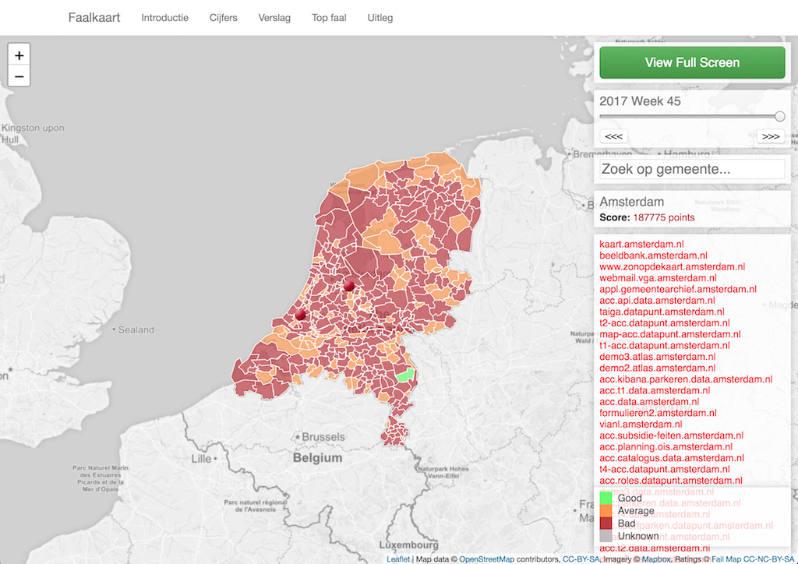

# Failmap server provisioning

This repository contains server provisioning for the Failmap project (https://faalkaart.nl).

The setup is flexible and configureable to allow easy deployment and management of multiple different instances for different organisations.

Features include:

- Basic system configuration
  - Firewall/Security/Updates
  - User accounts
  - Monitoring/Statistics
- High performance and secure public web frontend and backend for Failmap app
  - Automated TLS certificates
  - Caching
- Local asynchronous task processing and secure remote worker endpoint
- Failmap app administrative tooling

This configuration is intended to create a production quality, public facing, secure server running the Failmap application stack.

## Development

If you just like to try out Failmap without the intent to have it publicly accessible, or you just want to develop features for the app please have a look at the [Failmap](https://gitlab.com/failmap/failmap) repository instead.

For development or local testing of the provisioning please refer to [Development](documentation/development.md) documentation.

## Deployment/operations

Deployment and administrator documentation can be found at [Hosting](documentation/hosting.md) and [Operations](documentation/operations.md).

# Architecture
A Failmap production instance consist of multiple isolated components working together to form a whole.

## Main application components
Failmap main components:

**Frontend**
The Frontend is the public facing HTTP website of Failmap. It runs as a restricted/read-only instance with caching enabled. It's purpose is to serve as many visitor requests as efficiently as possible.

It is implemented as a restricted instance of the Failmap Django App. uWSGI instance running in a Docker container with read-only Database access. In front of which the Webserver provides TLS termination and caching.

**Admin**
The Admin is a HTTP website with restricted access. It runs an read/write instance and no caching. It's purpose is to provide the administrative portal and near real-time view of the data.

It is implemented as a full instance of the Failmap Django App. uWSGI instance running in a Docker container with full access to all Services (Database, Broker). In front is the Webserver providing TLS termination, client certificate validation and anti-caching.

**Worker**
The Worker is a asynchronous task executor. It picks up tasks for the Broker queue and accesses the Database for information query and result storing. All work (except for rendering HTTP responses) is handled by Workers.

The default worker is implemented as a Django Celery Worker running in a Docker container with full access to Database and Broker. Additional Workers exist specific for scanning tasks, these have no access to the Database.

Multiple instances of the Worker may be running simultaniously.

**Remote workers**
The concept of Remote workers exists where scanner tasks can be performed by multiple external hosts for scaling or resource (eg: unique ip addresses) purposes. The provisioning configuration allows the host to open up to external connections from Remote workers, for remote worker configuration refer to (Remote workers)[documentation/remote_workers.md].

**Scheduler**
The Scheduler ensures periodic tasks are scheduled at configured times. These tasks are then picked up by the Worker instance(s).

It is implemented as a Django Celery Beat running in a Docker container with full access to Database and Broker.

## Supporting components/services:

**Webserver**
The Webserver provides the HTTP interface to the World-Wide-Web™.

It sports Nginx providing TLS termination, client certificate authentication and on-disk (stale) caching.

**Database**
The Database provides persistant storage of all stateful data.

It is implemented as a host level MySQL instance.

**Broker**
The Broker provides a message bus for asynchronous task execution and distribution.

A redis instance bound to each specific instance (production, staging, etc) running inside a Docker container.

